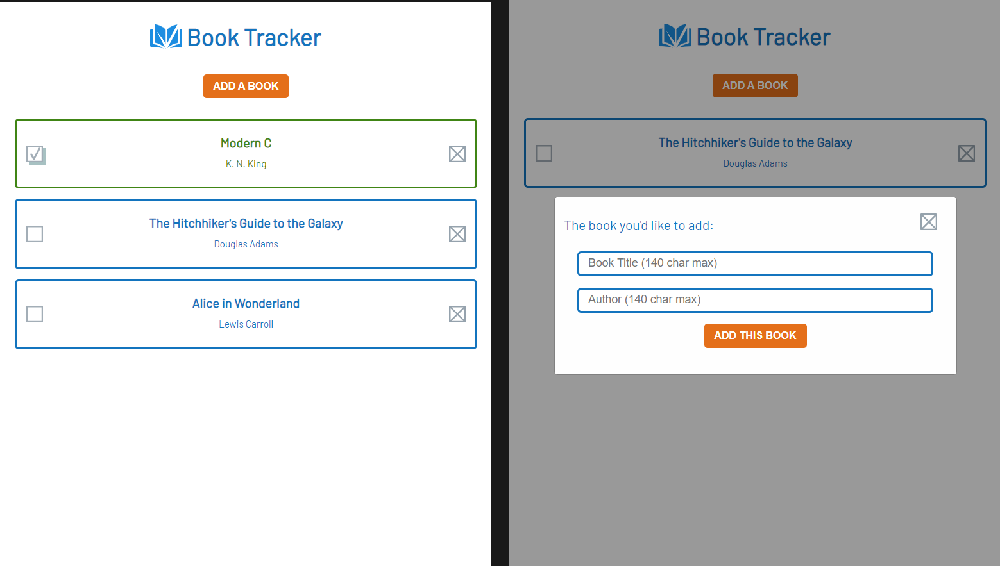
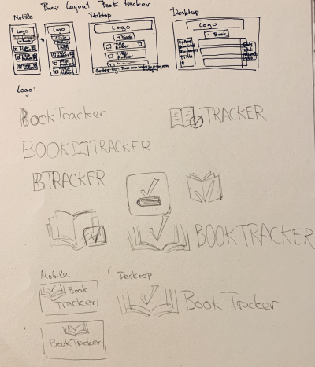
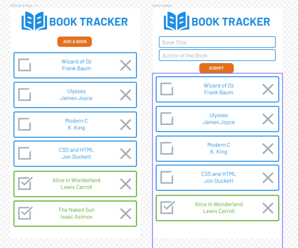

## Introduction
A Book Tracker app written in Javascript+CSS+HTML. Log which books you have read and books you plan on reading in the future, saving your book list in the local storage of the browser.

To view the live version of the page, [click on this link](https://lenablechmann.github.io/bookTracker/ "Book Tracker").

 

### Learning Goals/Topics
- learn to think with ~~portals~~ objects and prototypes
- use of object constructor
- how to save objects in local storage and retrieve them afterwards
- mobile first design
- learn variants in figma
- learn to make your own simple logos and other svgs in InkScape

### Project Specification
- There should be an "Add a new book” button 
- this "new book" btn should bring up a form allowing users to input the details for the new book
- user should input: author, title, number of pages, whether it’s been read and anything else you might want.
- Add a button on each book’s display to remove the book from the library
- associate your DOM elements with the actual book objects
- Add a button on each book’s display to change its read status. 
- store data in local storage

### Project Plan Step by Step
- [x] Plan out a rough wireframe for how your page will work in general: 
- [x] translate the wireframe into a design in figma (mobile first) 
- [x] create a simple logo for the app (learn Inkscape) 
- [x] divide the program into smaller segments and write prototypes for every segment you deem necessary
- [x] write out which id's and classes you'll need
- [x] create all the necessary HTML + CSS
- [x] add JavaScript

### Unexpected Problems and Learning Experiences:
- currently having trouble saying when the page is going to get reloaded.
- it's a lot harder to organize JS compared to C due to everything being passed by value, will have to learn how you organize JS without relying on global/localStorage
- Today I learned: just because JavaScript doesn't ask you for types during declarations, doesn't mean it doesn't work similarly to C in terms of types
- definitely need more practice with the debugger